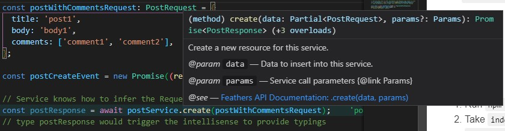
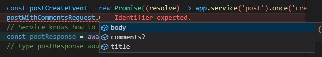
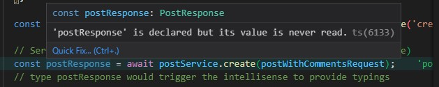
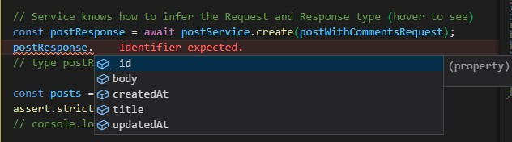

# feathers-request-response

This project is a demo for [feathers-request-response-pr](https://github.com/feathersjs/feathers/pull/2125) and we can define different set of request and response interface, and it can auto infer when using CRUD service method

## Why do we need a different set of request/response interface?

There are a couple of reasons but mainly is because not all request and response fields are the same. And having just one type, will work but loses the ability to control the typings. And also to provide better dev-experience.

With just one type, we define the interface like such

```js
interface Post {
    readonly _id: string; // client do not provide, server generated
    title: string;
    body: string;
    comments?: string[]; // client provide but is not actually part of Post "schema"
    createdAt: Date; // client do not provide, server generated
    updatedAt: Date; // client do not provide, server generated
}
```

And making the API call

```js
const response = app.service('post').create({
  title: 'title',
  body: 'body',
  // oops. force caller to put in those fields
  _id: ???
  createdAt: ???
});
```

As a client, making the API call to server, it is not required to pass in certain fields like `_id, createdAt, updatedAt`. However, due to only having one type, we need to make those fields optional.

```js
interface Post {
    readonly _id?: string;
    title: string;
    body: string;
    comments?: string[];
    createdAt?: Date;
    updatedAt?: Date;
}
```

Now, when we call the API as such

```js
const response = app.service('post').create({
  title: 'title',
  body: 'body',
});

// because createdAt is optional, typescript may complains if we want to access it
// createdAt may be null / undefined (something along the line)
// but we know that it will never be undefined
response.createdAt
```

## Scenario

For this demo, I am using `Post and Comment` as an example to illustrate the use case of a different Request / Response type.

Objective:

1. We can have a one set of interface for client to make the request
2. We could also have another set of request interface for server (if we want)
3. Lastly, one set of response interface to return back to client

TLDR;

1. Client make API call using `PostRequest` interface
2. Server takes that and convert to `ServerPostRequest` interface
3. Client receive `PostResponse` interface

Details;

Client is able to make a single API call to create a `Post` and `Comments`

```js
interface Base {
    readonly _id: string;
    createdAt: Date;
    updatedAt: Date;
}

/ Client facing interface
interface PostRequest {
    title: string;
    body: string;
    comments?: string[];
}

// Base fields generated at server side
interface ServerPostRequest extends PostRequest, Omit<Base, '_id'> {}

interface PostResponse extends Omit<PostRequest, 'comments'>, Base {}
```

From the interface above

1. We can provide more strict typing for client to provide only what is required, and/or optional, and not more.
2. When the request (`PostRequest`) is received at server, we can mutate the data to what is defined as `ServerPostRequest` in `post.before.create.hook`. In this case, defining the `createdAt, updatedAt` field.
3. Receiving an consistent `PostResponse` back at client. Having a different set of `response` also allow us to drop fields unrelated to the ones from the request (dropping `comments`)

## Result

Auto inferring `Request` and `Response` type






## Codes

1. Pay attention to `post.service.ts` and `comment.service.ts` interface declaration
2. See `create-comment.ts`, `print-post.ts` and `append-data.ts` hook
3. Lastly, see `post.test.ts` on all the type inference, and intellisense

## How to run this project

1. Run `npm i`
2. Take `index.d.ts` on the root directory of this project and copy into `node_modules/@feathersjs/feathers/index.d.ts`
3. Run `npm run mocha`

## About

This project uses [Feathers](http://feathersjs.com). An open source web framework for building modern real-time applications.

## Getting Started

Getting up and running is as easy as 1, 2, 3.

1. Make sure you have [NodeJS](https://nodejs.org/) and [npm](https://www.npmjs.com/) installed.
2. Install your dependencies

    ```
    cd path/to/feathers-request-response
    npm install
    ```

3. Start your app

    ```
    npm start
    ```

## Testing

Simply run `npm test` and all your tests in the `test/` directory will be run.

## Scaffolding

Feathers has a powerful command line interface. Here are a few things it can do:

```
$ npm install -g @feathersjs/cli          # Install Feathers CLI

$ feathers generate service               # Generate a new Service
$ feathers generate hook                  # Generate a new Hook
$ feathers help                           # Show all commands
```

## Help

For more information on all the things you can do with Feathers visit [docs.feathersjs.com](http://docs.feathersjs.com).
